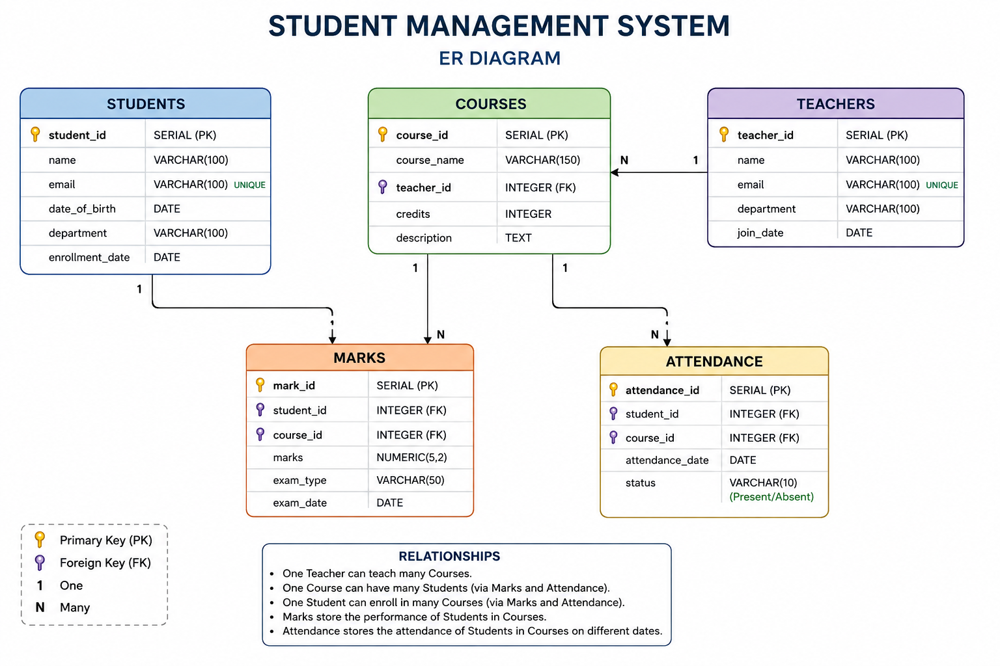

# Student Management System

A relational database project built using **PostgreSQL and SQL**.

## 📌 Project Overview

This project is a Student Management System designed to manage student academic information using a relational database.

The system contains five main components:

- Students
- Teachers
- Courses
- Marks
- Attendance

## 🛠️ Technologies Used

- PostgreSQL
- SQL
- pgAdmin
- Git
- GitHub

## 🗄️ Database Tables

### Students
Stores student details such as:
- Student ID
- Name
- Email
- Date of Birth
- Department

### Teachers
Stores teacher details such as:
- Teacher ID
- Name
- Email
- Department

### Courses
Stores:
- Course ID
- Course Name
- Teacher
- Credits

### Marks
Stores:
- Student
- Course
- Marks

### Attendance
Stores:
- Student
- Course
- Date
- Attendance Status

## 🔑 SQL Concepts Demonstrated

- CREATE TABLE
- INSERT
- SELECT
- UPDATE
- DELETE
- PRIMARY KEY
- FOREIGN KEY
- UNIQUE
- NOT NULL
- WHERE
- ORDER BY
- GROUP BY
- HAVING
- JOIN
- COUNT
- AVG
- MAX
- CASE
- Aggregate Functions

## 📊 Example Analysis

The project includes SQL queries for:

- Finding students by department
- Counting students by department
- Calculating average marks
- Finding highest-scoring students
- Finding average marks by course
- Displaying courses with their teachers
- Calculating attendance percentages
- Finding students with attendance below 75%

## 📁 Project Structure

```text
student-management-system/
│
├── README.md
│
└── sql/
    ├── 01_create_tables.sql
    ├── 02_insert_data.sql
    └── 03_queries.sql
```

## 🗺️ Entity Relationship Diagram

The following ER diagram shows the database tables and their relationships.




## ▶️ How to Run

1. Install PostgreSQL.
2. Open pgAdmin or another PostgreSQL client.
3. Create a PostgreSQL database.
4. Run `01_create_tables.sql`.
5. Run `02_insert_data.sql`.
6. Run queries from `03_queries.sql`.

## 🚀 Future Improvements

* Add an ER diagram
* Add more sample data
* Add advanced SQL queries
* Improve database constraints and validation
* Build a frontend application
* Connect the database with Python

## 👨‍💻 Author

**Vipin T K**
```
``
